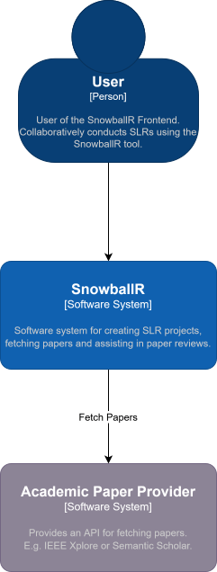
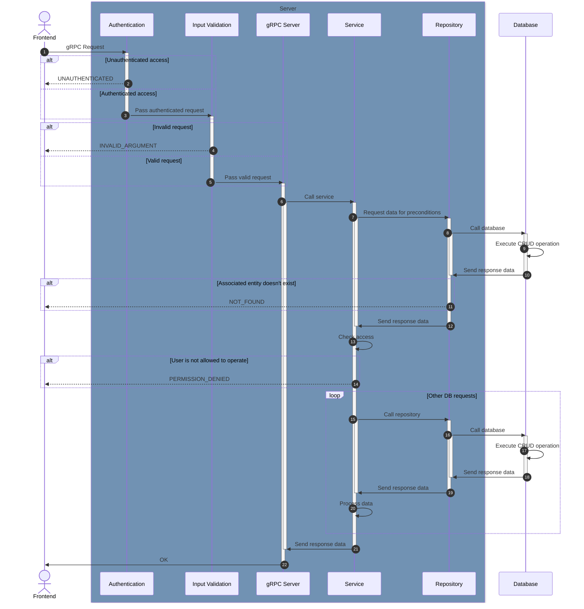
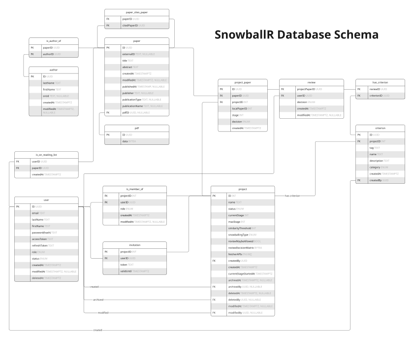

For our architecture, we follow the use-case-driven design methodology.
Our [system context](https://c4model.com/diagrams/system-context) is as follows:

The following sequence diagram shows how the backend handles a single request.
See below the diagram for the descriptions of each layer.

When an unexpected error occurs at any time in this diagram, an `INTERNAL` status code is sent to the frontend.

## Layers

### Authentication (2 - 3)

- Is an interceptor
- Read the request tokens and expect an `accessToken` and a `refreshToken`
- Verify token
- Fetch and pass on the associated user

### Input Validation (4 - 5)

- Is an interceptor
- Validate the request fields if necessary, e.g.
    - Is the string field non-blank and not too long?
    - Is the numeric field in a specific range?
- **Note that no semantic validation takes place**
    - e.g., it isn't checked whether an entity ID refers to an existing item
    - Semantic validation takes place in the [Service layer](#service-7-13---15-20---21)

### gRPC Server (6, 22)

- Mainly serves as a multiplexer for the [Service layer](#service-7-13---15-20---21)
- Call the according service method
- If the call was successful, the response payload is sent back to the frontend

### Service (7, 13 - 15, 20 - 21)

- Fetch required data
    - used to conduct the access check and other preconditions
    - used for later computations
- Check whether a user has access to an operation e.g., delete a project
- Call one or more [Repository](#repository-8---12-16---19) methods to execute CRUD operations

### Repository (8 - 12, 16 - 19)

- Implementation of the [Repository Pattern](https://medium.com/@pererikbergman/repository-design-pattern-e28c0f3e4a30)
- Works as a direct abstraction layer above the database
- Uses DSL to execute CRUD operations

## Database

The following diagram shows the database schema used in the SnowballR backend.

## Architecture Tests

To enforce our architecture, we conduct architecture tests using [ArchUnit](https://www.archunit.org/). You can find
them in [`src/test/kotlin/se/uulm/snowballr/backend/arch`](https://github.com/SE-UUlm/snowballr-backend/tree/develop/src/test/kotlin/se/uulm/snowballr/backend/arch).
